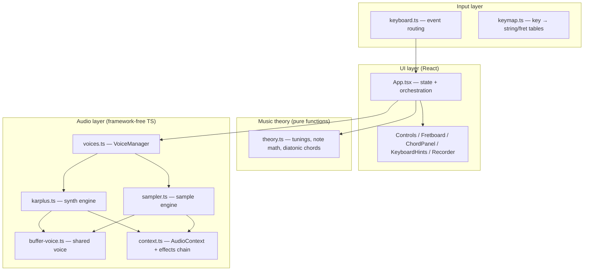
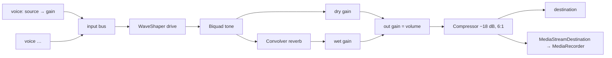

# EGuitar — Technical Design (System Design)

Companion to [DESIGN.md](DESIGN.md) (product design and roadmap). This document describes how the system is actually built: module boundaries, data flow, the audio graph, and the invariants each layer maintains.

## 1. System overview

EGuitar is a fully client-side web application. There is no backend, no network dependency at runtime, and no state outside the browser. The system is four layers with strictly one-directional dependencies:



Rules that keep this clean:

- **The audio layer never imports React.** It is plain TypeScript operating on the Web Audio API, unit-testable and reusable if the UI is ever replaced.
- **The music layer is pure functions** (midi math, chord construction) with no side effects and no imports from other layers.
- **`App.tsx` is the only orchestrator.** It owns all mutable UI state and is the only module that connects input events to audio calls.

## 2. Data flow of one note

```
physical keypress
  → window keydown (keyboard.ts): guard ⌘/Ctrl, guard auto-repeat, resolve e.code
  → handler in App.tsx: KEY_TO_POSITION[code] → (row, fret)
      stringIndex = windowOffset + row
      midi = tuning[stringIndex] + fret + 12 × octave
  → VoiceManager.pluck(engine, code, stringIndex, midi, velocity, muted)
      damps any note already sounding on that string
      applies held expression state (bend / vibrato) to the new voice
  → engine.pluck(): builds source → (lowpass if muted) → gain → effects input
  → React state: activeKeys + code → keycap highlight + string vibration CSS
keyup
  → VoiceManager.release(code) → voice.stop() (40 ms gain fade, source stopped at +300 ms)
  → activeKeys − code
```

Latency budget: keydown handling is synchronous; Karplus-Strong buffer rendering is ~170k float ops (< 1 ms); Web Audio output latency is the dominant term (~10–20 ms, hardware-dependent). No scheduling or lookahead is needed because every sound starts "now".

## 3. Audio graph

Built once, lazily, on the first `getAudio()` call (which happens on the first keypress — satisfying the browser autoplay policy since it's a user gesture).



- **Drive**: `tanh(k·x)` waveshaper curve, 2× oversampled. `curve = null` bypasses it (Acoustic/Clean).
- **Tone**: one biquad reconfigured per preset (lowshelf warmth / peaking presence / lowpass amp cab).
- **Reverb**: convolution with a generated impulse (1.2 s exponentially decaying noise) — zero audio assets.
- **Compressor**: safety limiter so six-voice strums don't clip.
- **Presets** only mutate node parameters — the graph topology never changes, so switching presets is glitch-free mid-note.

| Preset | Drive | Tone | Reverb wet |
|---|---|---|---|
| Acoustic | off | lowshelf +2 dB @ 220 Hz | 0.12 |
| Clean | off | peaking +3 dB @ 2.5 kHz | 0.20 |
| Drive | tanh(8x) | lowpass @ 3.2 kHz | 0.10 |

Settings chosen before the graph exists (e.g. restored from localStorage) are held in module-level variables and applied at construction time.

## 4. Sound engines

Both engines implement one interface; the rest of the system is engine-agnostic:

```ts
interface SoundEngine {
  pluck(midi: number, velocity?: number, muted?: boolean): VoiceHandle
  ready(): Promise<void>          // sampler: resolves after fetch + decode
}

interface VoiceHandle {
  stop(): void                    // damp like lifting a finger
  bend(semitones: number, glide?: number): void
  setVibrato(on: boolean): void
  dampen(factor: number): void    // legato transitions lose a little energy
}
```

### KarplusStrongEngine (default)

Physical model of a plucked string, rendered offline into an `AudioBuffer` per pluck:

- A delay line of `sampleRate / f0` samples is filled with white noise (the pluck transient).
- Each pass, adjacent samples are averaged and multiplied by a decay factor — the averaging is an inherent lowpass, so high harmonics die first, exactly as on a real string.
- Decay is applied once per period traversal, so decay-per-second scales with frequency: high notes naturally ring shorter than low notes with the same coefficient.
- `decay = 0.996` open, `0.97` palm-muted. Muted plucks also pass through a 1.4 kHz lowpass.
- Rendering 3.5 s at 48 kHz is ~170k iterations — cheap enough to synthesize per keypress, which gives free organic variation (every pluck has fresh noise).

### SamplerEngine

- 12 recorded acoustic guitar notes (tonejs-instruments, CC-BY), one every 3 semitones from E2 to C5, imported as Vite assets so they inline into the single-file build as base64.
- `ready()` fetches and decodes all samples once (idempotent via a memoized promise); the UI keeps the engine unselectable until it resolves.
- A pluck picks the nearest sampled midi and pitch-shifts with `playbackRate = 2^(Δsemitones/12)` — worst case ±1.5 semitones, inaudible as an artifact.
- Palm mute is faked (samples can't be re-recorded): fast gain envelope chop + the same 1.4 kHz lowpass.

### BufferVoice (shared)

Both engines emit `AudioBufferSourceNode → GainNode`, so one voice class serves both:

- `stop()`: 40 ms exponential gain fade, source stopped at +300 ms. Idempotent.
- `bend(n)`: linear ramp of `playbackRate` toward `baseRate · 2^(n/12)` (120 ms glide). `baseRate` matters because sampler voices don't start at rate 1.
- `setVibrato(on)`: a 5.5 Hz `OscillatorNode → GainNode` (± ~25 cents, scaled by `baseRate`) connected *into the `playbackRate` AudioParam* — the LFO runs on the audio thread, so vibrato is sample-accurate and free of JS jitter.

## 5. Voice management

`VoiceManager` maintains two maps and the guitar's key invariant — **one pitch per string**:

- `byKey: code → voice` — so a keyup damps exactly the note that keydown started.
- `byString: stringIndex → {key, voice}` — plucking a string that is already ringing stops the old voice first (a physical string can't sound two pitches).
- Chord strums use synthetic keys (`chord-0…5`) on string indexes 0–5, so re-strumming damps the previous chord string-by-string as the pick sweep progresses.
- Expression state (`bendSemitones`, `vibrato`) lives here so notes plucked *while* ↑/↓ is held inherit the expression immediately.
- `releaseAll()` on mode switches prevents stuck notes when keyup routing changes.

**Legato (hammer-on / pull-off / slide).** `App.tsx` keeps a per-string stack of physically held keys, mirroring fingers on a fret. Pressing a key on an already-fingered string calls `VoiceManager.legato()` instead of `pluck()`: the ringing voice's `playbackRate` is retuned to the new fret (12 ms jump = hammer-on; 120 ms glide with ⇧ = slide), ownership in `byKey` moves to the new key, and the voice loses ~8% gain per transition. Releasing the sounding key while a lower finger remains on the stack retunes back to it — a pull-off. Each `StringEntry` stores the original pluck midi and the current legato `offset`, so the global ↑ bend composes with legato (`bend(offset + bendSemitones)`) instead of overwriting it. No new attack transient is generated anywhere in the path — which is acoustically what makes legato legato.

Polyphony is bounded structurally: 4 lead strings + 6 chord strings ≈ 10 concurrent voices worst case, plus 300 ms damping tails. No voice-stealing pool is needed beyond the per-string rule.

## 6. Input pipeline

Single `window`-level keydown/keyup listener pair, attached once (React ref pattern keeps handlers fresh without re-subscribing).

Routing order (first match wins): ⌘/Ctrl passthrough → Tab (mode toggle) → ⇧+↑/↓ (octave) → `[`/`]` (string window) → *chord mode:* Space/Enter (strum, ⌥ = chuck), ←/→ (key), 1–7 (chord) → *lead mode:* ↑/↓ (bend/vibrato), note keys (pluck, ⌥ = palm mute).

Design decisions:

- **`event.code` everywhere** (physical key position) — layout- and modifier-independent, so ⌥+G still resolves to `KeyG` even though macOS types "©".
- **`event.repeat` guard** — OS auto-repeat must not re-pluck; holding a key means "let it ring".
- **Mac conventions** (user constraint): ⌥ as the expression modifier, no Ctrl+arrow combos (Mission Control owns them), Mac key glyphs (⇧⌥⇥⏎) in all UI hints.
- `preventDefault()` on all handled keys (Tab focus-walk, Space scroll, `/` quick-find, arrow scroll).

## 7. State & persistence

All UI state lives in `App.tsx` as React `useState` — no store library at this scale:

| State | Persisted | Notes |
|---|---|---|
| `octave` (−2…+2), `windowOffset` (0…2) | yes | pitch math inputs |
| `mode`, `keyRoot`, `preset`, `volume`, `engineId` | yes | restored on boot |
| `chordDegree`, `activeKeys`, `samplerState` | no | ephemeral/derived |

Persistence is one `localStorage` key (`eguitar-settings`, JSON) written by a single effect on any change; load is one parse at module scope with per-field fallbacks, so schema evolution is additive. Boot sequence: restore state → push volume/preset into the (not yet created) audio layer's pending variables → if the saved engine was `acoustic`, start the sample load in the background.

Audio-side state (current preset, desired volume, expression) deliberately lives in the audio layer, not React — the UI mirrors it rather than owning it, so a future non-React frontend needs no changes below `App.tsx`.

## 8. Build & distribution

- **Vite + React + TypeScript**, Node 22 (pinned by `.nvmrc`), strict TS (`tsc --noEmit` gates the build).
- `vite-plugin-singlefile` + `base: './'` produce **one self-contained `dist/index.html` (~3 MB, ~510 kB gzipped)**: JS, CSS, and all 12 samples (base64) inlined. Runs from `file://`, a USB stick, or any static host on any OS — this is the project's portability contract; any new asset must inline or degrade gracefully.
- Dev: `npm run dev` (Vite dev server, port 5173).

## 9. Failure modes & edge cases

| Case | Handling |
|---|---|
| Autoplay policy (no sound before gesture) | AudioContext created/resumed inside the first keypress |
| Sample fetch/decode fails | engine switch shows "Acoustic ✕", stays on synth, error logged |
| Sampler pluck before load completes | returns a silent no-op voice, never throws |
| Stuck notes on mode/window changes | `releaseAll()` on mode toggle; voices keyed by `code` survive window slides |
| OS key auto-repeat | `event.repeat` guard on all one-shot actions |
| Clipping on 6-voice strums | master compressor (−18 dB threshold, 6:1) |
| Corrupt localStorage | try/catch parse → fresh defaults |

## 10. Extension points

- **New sound engine** (electric samples, physical-model variants): implement `SoundEngine`, add to the `engines` record — no other changes.
- **Tablature playback / practice mode**: a scheduler that maps tab events to the same `VoiceManager.pluck()` calls and highlights keycaps via `activeKeys`.
- **MIDI out**: mirror `pluck`/`release` to Web MIDI; the (string, fret) → midi math already exists in one place.
- **New tone presets**: one entry in the preset switch + one case in `applyPreset()` (parameter changes only, no graph edits).
- **Alternate tunings**: `STANDARD_TUNING` is data; a tuning selector is UI + one array swap.
